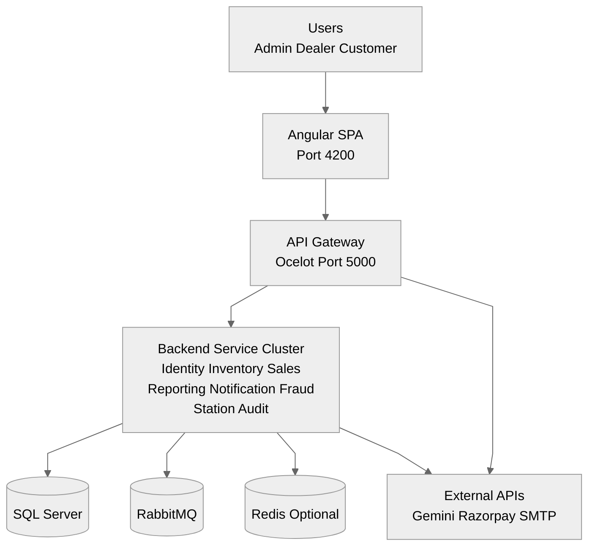
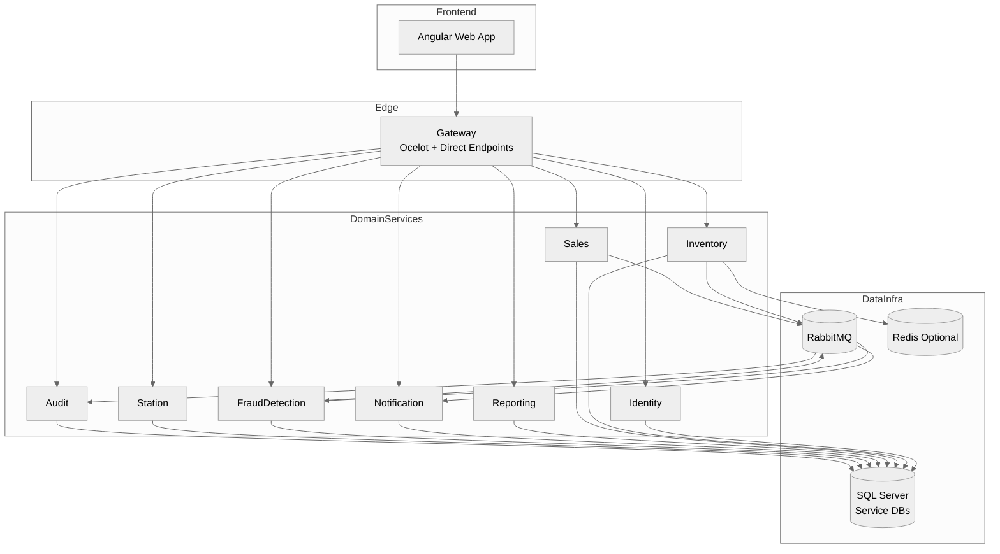
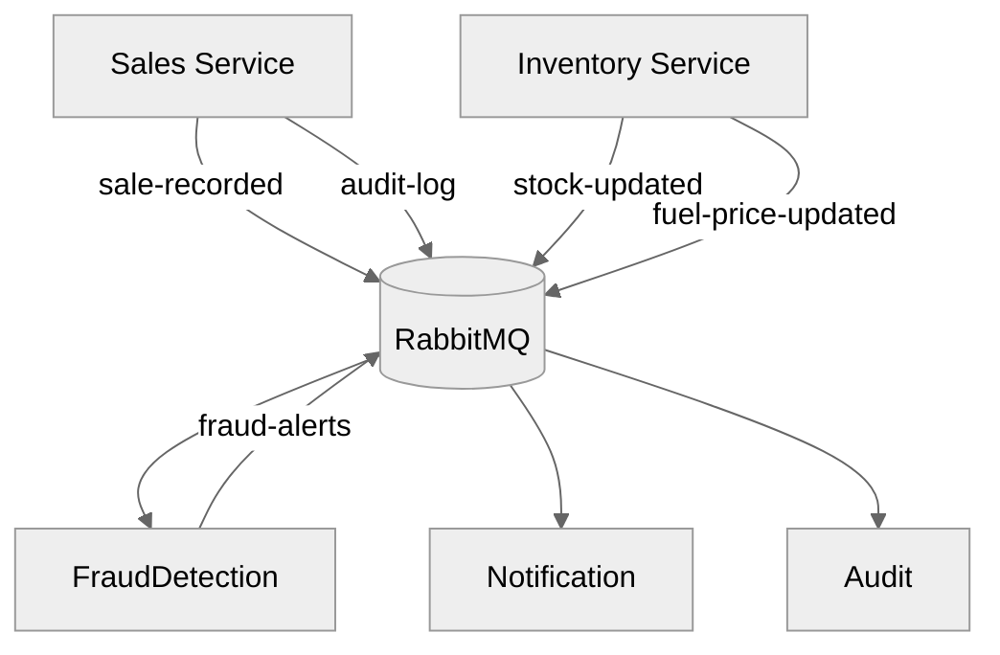
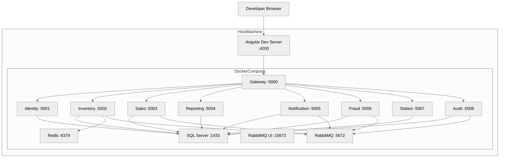

# Fuel Flow - High-Level Design (HLD)

Version: 1.0  
Date: 2026-04-17  
System: Fuel Flow (Angular SPA + .NET microservices)

## 1. Purpose

This document defines the high-level architecture for Fuel Flow, a role-based fuel management platform with the following business goals:

1. Provide a single operational platform for Admin, Dealer, and Customer personas.
2. Support core fuel operations: stations, inventory, sales, reporting, fraud monitoring, notifications, and auditing.
3. Maintain clear service ownership and extensibility using microservices and asynchronous event-driven workflows.

## 2. Scope

### In Scope

1. Angular web application and role-based UI modules.
2. API Gateway and 8 backend microservices.
3. SQL Server, RabbitMQ, and Redis integration.
4. Public contact flow, optional AI helper, and optional payment helper endpoints.

### Out of Scope

1. Native mobile clients.
2. Multi-region production deployment automation.
3. Enterprise IAM federation (SAML/OIDC providers).

## 3. Stakeholders and Actors

1. Admin: user governance, fraud, reports, stations, pricing oversight.
2. Dealer: sales entry, inventory updates, pump operations, shift operations.
3. Customer: order tracking, price visibility, receipts, nearby stations.
4. Platform Ops: deployment, monitoring, infrastructure operations.

## 4. Architectural Drivers

### Functional Drivers

1. JWT authentication with role-based authorization.
2. Sale and inventory updates with event fan-out to fraud, notification, and audit domains.
3. Reporting document generation (PDF/Excel) and download.
4. Public contact form mail dispatch path.

### Non-Functional Drivers

1. Scalability: service-level horizontal scaling behind API Gateway.
2. Reliability: asynchronous decoupling through RabbitMQ.
3. Security: role checks at API level + token-based access.
4. Maintainability: bounded microservice ownership and shared contracts.
5. Observability: health endpoints, correlation IDs, structured logs.

## 5. System Context View

Diagram note: all diagrams are top-down and split into smaller views to keep page width compact.

## 6. Container View

## 7. Bounded Contexts and Ownership

| Service | Bounded Context | Key Responsibility |
| --- | --- | --- |
| Identity | Access & Identity | Auth, OTP, tokens, user profile and role management |
| Inventory | Tank & Stock | Fuel tanks, stock alerts, replenishment, pricing |
| Sales | Transaction Ops | Sales transactions, receipts, pump management, idempotent create |
| Reporting | Analytics Output | Report request lifecycle, file generation, downloads |
| Notification | User Communication | Event-driven alerts, price-drop subscriptions, contact form mail |
| FraudDetection | Risk Control | Rule-based fraud analysis and alert generation |
| Station | Station Registry | Station master data, hours, nearby station search |
| Audit | Compliance Trail | Immutable-style audit log ingestion and querying |

## 8. Integration View

### 8.1 Synchronous Request Pattern

1. Browser calls only `/gateway/*`.
2. Ocelot routes request to target downstream service.
3. Service validates JWT/roles, executes domain logic, persists data.
4. Response returns via gateway to client.

### 8.2 Asynchronous Event Pattern

## 9. High-Level Deployment View

## 10. Security View

1. JWT Bearer token validation at Gateway and service boundaries.
2. Role enforcement (`Admin`, `Dealer`, `Customer`) in controllers and Angular route guards.
3. Public anonymous surfaces restricted to specific endpoints only (for example contact form, selected station reads).
4. Correlation ID middleware for request traceability.

## 11. Reliability and Resilience View

1. Event-driven decoupling for fraud/notification/audit side effects.
2. Sales write idempotency via `Idempotency-Key` + in-memory cache window.
3. Inventory read cache via Redis (graceful fallback if Redis is unavailable).
4. Notification startup/consumer logic hardened to tolerate infra dependency outages.

## 12. Scalability Strategy

1. Stateless APIs allow horizontal scaling per service.
2. API Gateway centralizes edge concerns (route, rate-limit, auth pre-check).
3. Queue-based processing supports burst smoothing and asynchronous throughput.
4. Service-specific data stores reduce cross-domain lock contention.

## 13. Risks and Mitigations

| Risk | Impact | Mitigation |
| --- | --- | --- |
| RabbitMQ outage | Delayed downstream alerts/audit/fraud processing | Durable queues, startup tolerance, retry/recovery operations |
| SQL Server unavailability | Service write/read failure | Health checks, startup migration controls, backup/restore procedures |
| External API quota limits (AI) | AI helper degradation | Fallback replies and configurable model/key settings |
| Shared host resource saturation | Latency spikes | Service-level scaling, resource limits, performance monitoring |

## 14. Architecture Decisions Summary

1. Microservices over monolith to isolate ownership and enable independent evolution.
2. Ocelot gateway as single browser entry point for route and policy centralization.
3. RabbitMQ event model for cross-domain side effects and temporal decoupling.
4. SQL-per-service boundary for domain autonomy and clearer ownership.
5. Optional Redis cache in inventory path to improve frequent read response times.
