# Fuel Flow - Low-Level Design (LLD)

Version: 1.0  
Date: 2026-04-17  
System: Fuel Flow

## 1. Purpose

This document describes the concrete low-level design for Fuel Flow implementation, including:

1. Use cases and interaction flows.
2. Component-level architecture.
3. API and event contracts.
4. Data ownership and persistence model.
5. Deployment topology and runtime dependencies.
6. Sequence and decision flow diagrams.

Diagram note: diagrams are intentionally compact, top-down, and split by scenario to avoid page overflow.

## 2. Use Case View

| ID | Use Case | Primary Actor | Primary Services |
| --- | --- | --- | --- |
| UC-01 | Login with password | Admin/Dealer/Customer | Gateway, Identity |
| UC-02 | Login with OTP | Admin/Dealer/Customer | Gateway, Identity, SMTP |
| UC-03 | Record sale | Dealer/Admin | Gateway, Sales, RabbitMQ |
| UC-04 | Detect fraud from sale event | System | FraudDetection, RabbitMQ |
| UC-05 | Update tank level and raise low-stock alert | Dealer/Admin | Inventory, Notification, RabbitMQ |
| UC-06 | Subscribe to price-drop alert | Customer | Notification, SMTP |
| UC-07 | Generate and download report | Admin/Dealer | Reporting |
| UC-08 | Submit public contact form | Visitor | Gateway, Notification, SMTP |
| UC-09 | Query audit trail | Admin | Audit |
| UC-10 | Browse nearby stations | Customer/Visitor | Station |

### 2.1 Use Case Details

#### UC-01 Login with Password

1. Precondition: user account exists and is active.
2. Client posts credentials to `/gateway/auth/login`.
3. Identity validates password hash (BCrypt), issues JWT and refresh token.
4. Frontend stores JWT and uses interceptor to attach `Authorization: Bearer <token>`.
5. Role guards route user to role-specific area.

#### UC-03 Record Sale

1. Precondition: authenticated Dealer/Admin and active pump.
2. Client posts transaction to `/gateway/sales/transactions` with optional `Idempotency-Key`.
3. Sales checks duplicate by `(user, idempotencyKey)` in memory cache.
4. Sales persists transaction and receipt number.
5. Sales publishes `sale-recorded` and `audit-log` events.

#### UC-05 Update Tank Level

1. Dealer/Admin updates level via `/gateway/inventory/tanks/{id}/level`.
2. Inventory validates range, updates tank and active alert triggers.
3. Inventory publishes `stock-updated` event.
4. Notification consumer creates low-stock notification when threshold breached.

#### UC-08 Submit Public Contact Form

1. Visitor submits landing form to `/gateway/public/contact`.
2. Gateway forwards to Notification public contact endpoint.
3. Notification validates payload and sends branded email to configured recipient.
4. Client receives success (`status=Received`) or actionable error.

## 3. Runtime Component View

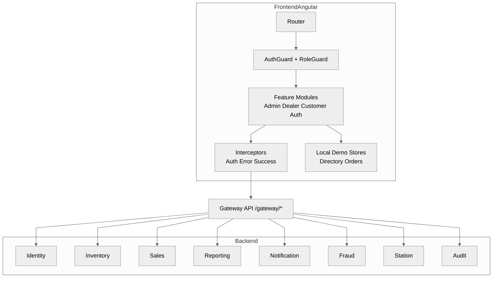

## 4. Gateway Route Design

| Upstream Prefix | Downstream Service | Auth | Notes |
| --- | --- | --- | --- |
| `/gateway/auth/*` | Identity `/api/auth/*` | Anonymous + guarded by endpoint intent | Login/register/OTP/password reset/logout |
| `/gateway/users/*` | Identity `/api/users/*` | Bearer | User management |
| `/gateway/inventory/tanks/*` | Inventory `/api/tanks/*` | Bearer | Tanks, levels, prices |
| `/gateway/inventory/alerts/*` | Inventory `/api/alerts/*` | Bearer | Stock alerts |
| `/gateway/inventory/replenishment/*` | Inventory `/api/replenishment/*` | Bearer | Replenishment orders |
| `/gateway/sales/transactions/*` | Sales `/api/transactions/*` | Bearer | Sale transactions |
| `/gateway/sales/pumps/*` | Sales `/api/pumps/*` | Bearer | Pump management |
| `/gateway/reporting/*` | Reporting `/api/reports/*` | Bearer | Reports |
| `/gateway/notifications/*` | Notification `/api/notifications/*` | Bearer | Notifications + price alerts |
| `/gateway/fraud/*` | Fraud `/api/fraud/*` | Bearer | Fraud rules and alerts |
| `/gateway/stations/*` | Station `/api/stations/*` | Bearer (endpoint-level anonymous allowed for reads) | Station directory |
| `/gateway/audit/*` | Audit `/api/audit/*` | Bearer | Audit logs |
| `/gateway/public/contact` | Notification `/api/public/contact` | Anonymous | Rate-limited public contact endpoint |

### 4.1 Gateway Direct Endpoints (Non-Ocelot)

1. `/healthz` and `/health`
2. `/gateway/ai/chat` (Gemini with fallback replies)
3. `/gateway/payments/create-order`
4. `/gateway/payments/verify`

## 5. Service Internal Design

### 5.1 Identity Service

Core components:

1. `AuthController`: login/register/otp/refresh/logout.
2. `UsersController`: user profile and role operations.
3. `TokenService`: JWT + refresh token handling.
4. `EmailOtpService`: OTP generation/verification/mail dispatch.
5. `IdentityDbContext`: `Users`, `RefreshTokens`, `EmailOtpTokens`.

### 5.2 Inventory Service

Core components:

1. `TanksController`: CRUD-like tank operations, price/level updates.
2. `AlertsController`: stock alert lifecycle.
3. `ReplenishmentController`: replenishment order lifecycle.
4. `InventoryDbContext`: `Tanks`, `Alerts`, `ReplenishmentOrders`.
5. Redis cache for tank and price reads (`tanks:*`, `tanks:prices`).
6. RabbitMQ publishing for `stock-updated` and `fuel-price-updated`.

### 5.3 Sales Service

Core components:

1. `TransactionsController`: create/list/get/summary.
2. `PumpsController`: create/update/query pumps.
3. `SalesDbContext`: `Transactions`, `Pumps`.
4. In-memory idempotency window keyed by user + `Idempotency-Key`.
5. Event publication: `sale-recorded`, `audit-log`.

### 5.4 Reporting Service

Core components:

1. `ReportsController`: dashboard, list, generate, download.
2. `ReportingDbContext`: `Reports`.
3. File generation pipeline:
   1. Excel via EPPlus.
   2. PDF via iText.

### 5.5 Notification Service

Core components:

1. `NotificationsController`: manual send + logs.
2. `PriceAlertsController`: subscription management.
3. `PublicContactController`: anonymous contact submission flow.
4. `NotificationBackgroundService`: queue consumers.
5. `NotificationDbContext`: `NotificationLogs`, `PriceDropSubscriptions`.
6. SMTP sender and branded email templates.

### 5.6 FraudDetection Service

Core components:

1. `FraudController`: alert/rule operations and inline analyze endpoint.
2. `FraudDetectionBackgroundService`: subscribes to `sale-recorded` and evaluates active rules.
3. `FraudDbContext`: `FraudAlerts`, `FraudRules`.
4. Event publication: `fraud-alerts`.

### 5.7 Station Service

Core components:

1. `StationsController`: station CRUD + hours + nearby search.
2. Haversine distance calculation for nearby stations.
3. `StationDbContext`: `Stations`, `OperatingHours`.

### 5.8 Audit Service

Core components:

1. `AuditController`: log query/entity history/manual write.
2. `AuditBackgroundService`: consumes `audit-log` queue events.
3. `AuditDbContext`: `AuditLogs` with query-friendly indexes.

## 6. Data Ownership View

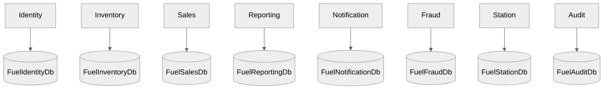

### 6.1 Key Entities by Service

| Service | Key Entities |
| --- | --- |
| Identity | `ApplicationUser`, `RefreshToken`, `EmailOtpToken` |
| Inventory | `FuelTank`, `StockAlert`, `ReplenishmentOrder` |
| Sales | `Transaction`, `Pump` |
| Reporting | `Report` |
| Notification | `NotificationLog`, `PriceDropSubscription` |
| FraudDetection | `FraudAlert`, `FraudRule` |
| Station | `FuelStation`, `OperatingHours` |
| Audit | `AuditLog` |

## 7. Event Contract and Queue Design

### 7.1 Domain Events (Shared Contracts)

1. `StockUpdatedEvent`
2. `SaleRecordedEvent`
3. `FraudAlertEvent`
4. `AuditEvent`
5. `NotificationEvent`
6. `FuelPriceUpdatedEvent`

### 7.2 Queue Matrix

| Queue | Publisher | Consumer(s) | Business Purpose |
| --- | --- | --- | --- |
| `sale-recorded` | Sales | FraudDetection, Notification | Fraud analysis + high-value notifications |
| `audit-log` | Sales (and extensible others) | Audit | Central audit trail |
| `stock-updated` | Inventory | Notification | Low stock alerting |
| `fuel-price-updated` | Inventory | Notification | Price-drop subscription matching |
| `fraud-alerts` | FraudDetection | Notification | Fraud escalation notifications |

## 8. Sequence Diagrams

### 8.1 Login (Password)

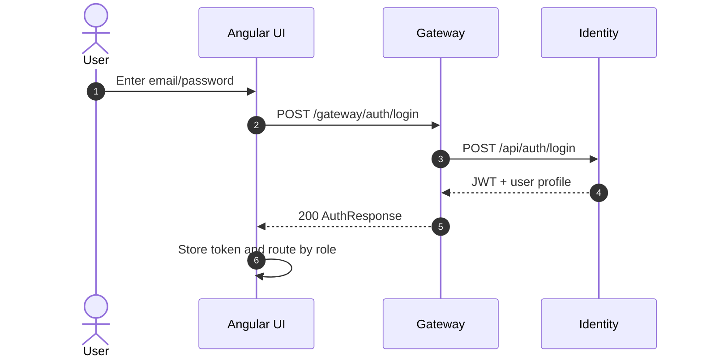

### 8.2 Sale Command Path

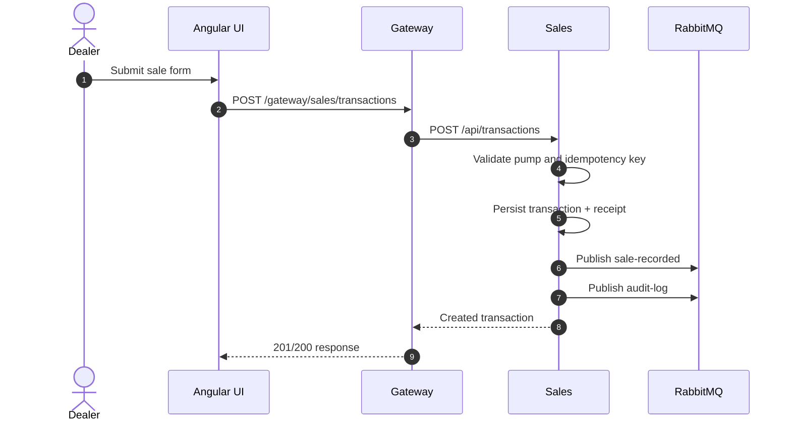

### 8.3 Event Fan-Out after Sale

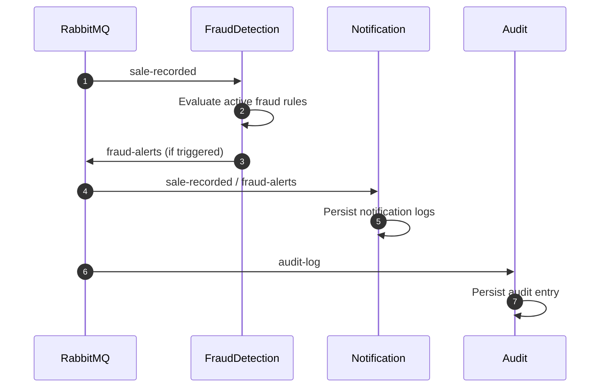

### 8.4 Price-Drop Subscription and Trigger

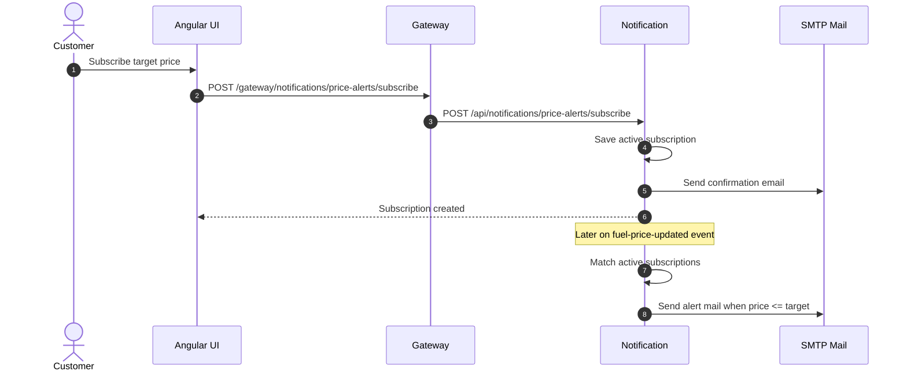

### 8.5 Public Contact Submission

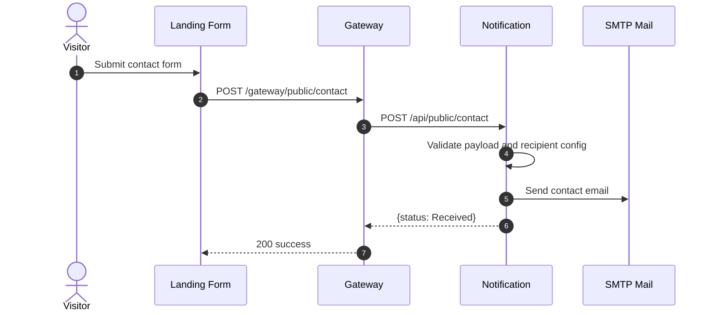

### 8.6 Report Generation and Download

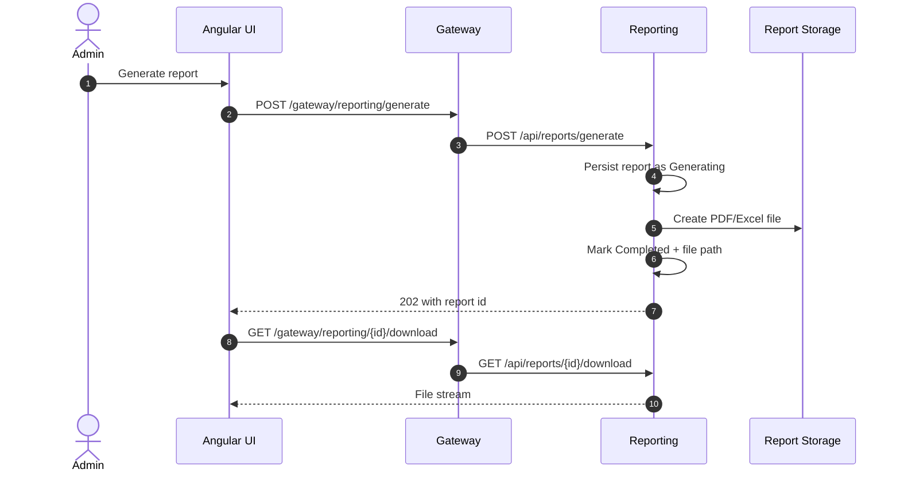

## 9. Decision Flowcharts

### 9.1 Sales Idempotency Decision Flow

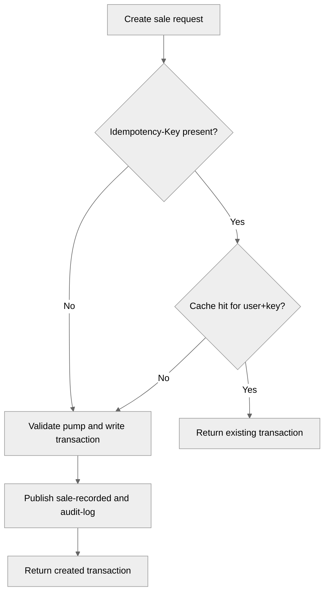

### 9.2 Price Alert Trigger Flow

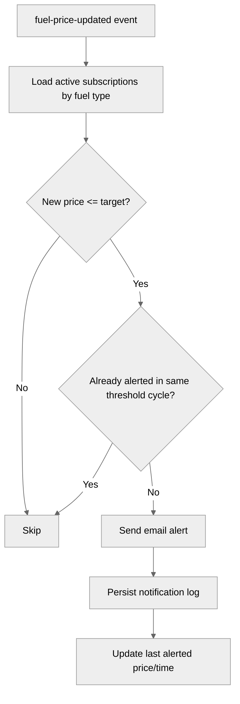

## 10. Deployment View

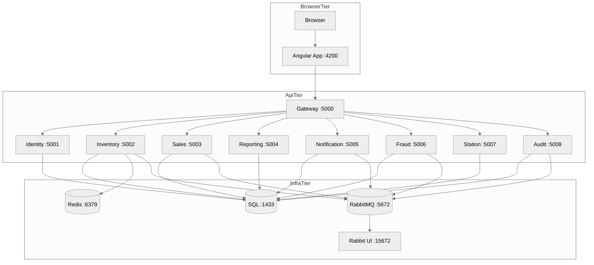

### 10.1 Runtime Dependencies

| Service | Depends On |
| --- | --- |
| Gateway | All API services |
| Identity | SQL Server |
| Inventory | SQL Server, Redis (optional), RabbitMQ |
| Sales | SQL Server, RabbitMQ |
| Reporting | SQL Server |
| Notification | SQL Server, RabbitMQ, SMTP |
| FraudDetection | SQL Server, RabbitMQ |
| Station | SQL Server |
| Audit | SQL Server, RabbitMQ |

## 11. Cross-Cutting Technical Design

### 11.1 Authentication and Authorization

1. JWT settings shared across services.
2. Angular auth interceptor injects bearer token.
3. Route guards plus API `[Authorize(Roles=...)]` enforce role boundaries.

### 11.2 Error and Correlation Handling

1. Shared middleware emits correlation IDs (`X-Correlation-ID`).
2. Global exception middleware returns `application/problem+json` shape.

### 11.3 Caching Strategy

1. Inventory read paths cache tank/price lists in Redis for 5 minutes.
2. Cache keys are invalidated after level/price writes.
3. Service runs without cache when Redis is unavailable.

### 11.4 Reliability Controls

1. Sales idempotency for duplicate-submit protection.
2. Queue consumers process with explicit ack semantics in shared Rabbit service.
3. Notification background subscriptions are wrapped to tolerate broker outages.

### 11.5 Security Controls

1. Public endpoint surface restricted to explicit anonymous routes.
2. Gateway rate limit on public contact route.
3. Secure secrets expected via environment variables (`.env` in dev).

## 12. Performance Considerations

1. Read-heavy endpoints leverage Redis cache where useful.
2. Pagination implemented on major listing APIs.
3. Event-driven side effects prevent synchronous write-path blocking.

## 13. Known Constraints and Design Trade-Offs

1. Some frontend modules (for example order and directory demos) are intentionally localStorage-backed for demo continuity.
2. Report generation is currently synchronous-in-request style inside Reporting service for simplicity.
3. RabbitMQ transport currently uses default guest credentials in local environment.

## 14. Suggested Engineering Enhancements

1. Add retry + dead-letter queue strategy per critical event queue.
2. Move report generation to async worker for large workloads.
3. Add distributed tracing export (OpenTelemetry) with correlation propagation.
4. Add refresh-token rotation replay detection and session management dashboard.
